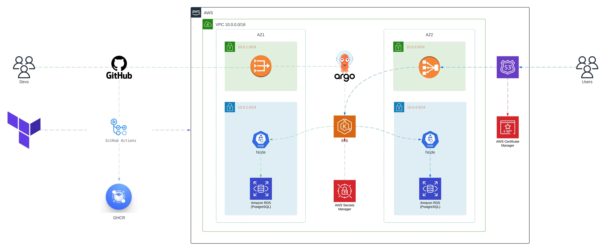

	<code></code>
	<code></code>
  <code></code>
  <code></code>
	<code></code>
  <code></code>
	<code></code>
  <code></code>
  <code></code>
	<code></code>
	<code></code>

 

    
  <h3 align="center">SoftServe DevOps Development</h3>

  

    GreenCity
     
    <a href="https://github.com/ita-social-projects/GreenCity"><strong>Explore»</strong></a>
  

  
Table of Contents

  <ol>
    <li>
      <a href="#about-the-project">About The Project</a>
    </li>
    <li>
      <a href="#getting-started">Getting Started</a>
      <ul>
        <li><a href="#prerequisites">Prerequisites</a></li>
        <li><a href="#installation">Installation</a></li>
      </ul>
    </li>
    <li><a href="#usage">Usage</a></li>
    <li><a href="#contributing">Contributing</a></li>
    <li><a href="#license">License</a></li>
    <li><a href="#contact">Contact</a></li>
    <li><a href="#acknowledgments">Acknowledgments</a></li>
  </ol>

## About The Project

